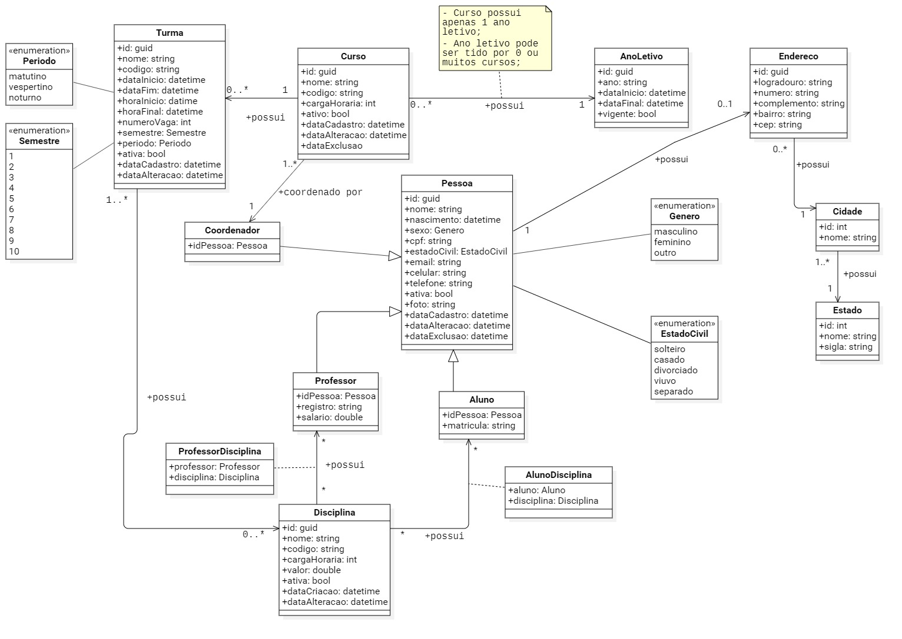

# Sistema Escolar

## Diagrama de classe do sistema
<br>



<br>
<br>

# Referências entre camadas

## Application

```sh
dotnet add 
.\Application\Application.csproj reference 
.\Domain\Domain.csproj 
```
## Infrastructure

```sh
dotnet add 
.\Infrastructure\Infrastructure.csproj reference 
.\Application\Application.csproj 

dotnet add 
.\Infrastructure\Infrastructure.csproj reference 
.\Domain\Domain.csproj  
```
## Presentation

```sh
dotnet add 
.\Presentation\Presentation.csproj reference 
.\Infrastructure\Infrastructure.csproj 

dotnet add 
.\Presentation\Presentation.csproj reference 
.\Application\Application.csproj
```
<br><br>

# EF Core 5.0

Irei instalar os pacotes do ***EntityFrameworkCore*** necessários para cada camada do projeto.


## Infrastructure

```sh
dotnet add package Microsoft.EntityFrameworkCore
dotnet add package Microsoft.EntityFrameworkCore.Tools
```

## Presentation

```sh
dotnet add package Microsoft.EntityFrameworkCore.Sqlite
dotnet add package Microsoft.EntityFrameworkCore.Design
```
<br><br>

# Migrations

* Instalar o `dotnet ef`.

```sh
dotnet tool install --global dotnet-ef
```

* Adicionando a Migration

```sh
dotnet ef migrations add InitialCreate 
--project .\Infrastructure\Infrastructure.csproj 
--startup-project .\Presentation\Presentation.csproj
```

* Criando ou Alterando o Banco de Dados

```sh
dotnet ef database update 
--project .\Infrastructure\Infrastructure.csproj 
--startup-project .\Presentation\Presentation.csproj  
```
<br><br>

# Referências

* ### [Introdução ao EF Core](https://docs.microsoft.com/pt-br/ef/core/get-started/?tabs=netcore-cli)

* ### [Install Entity Framework Core](https://www.entityframeworktutorial.net/efcore/install-entity-framework-core.aspx)

* ### [Migration in Entity Framework Core](https://www.entityframeworktutorial.net/efcore/entity-framework-core-migration.aspx)

* ### [Visão geral das migrações](https://docs.microsoft.com/pt-br/ef/core/managing-schemas/migrations/?tabs=dotnet-core-cli)

* ### [Usando um projeto de migrações separado](https://docs.microsoft.com/pt-br/ef/core/managing-schemas/migrations/projects?tabs=dotnet-core-cli)

